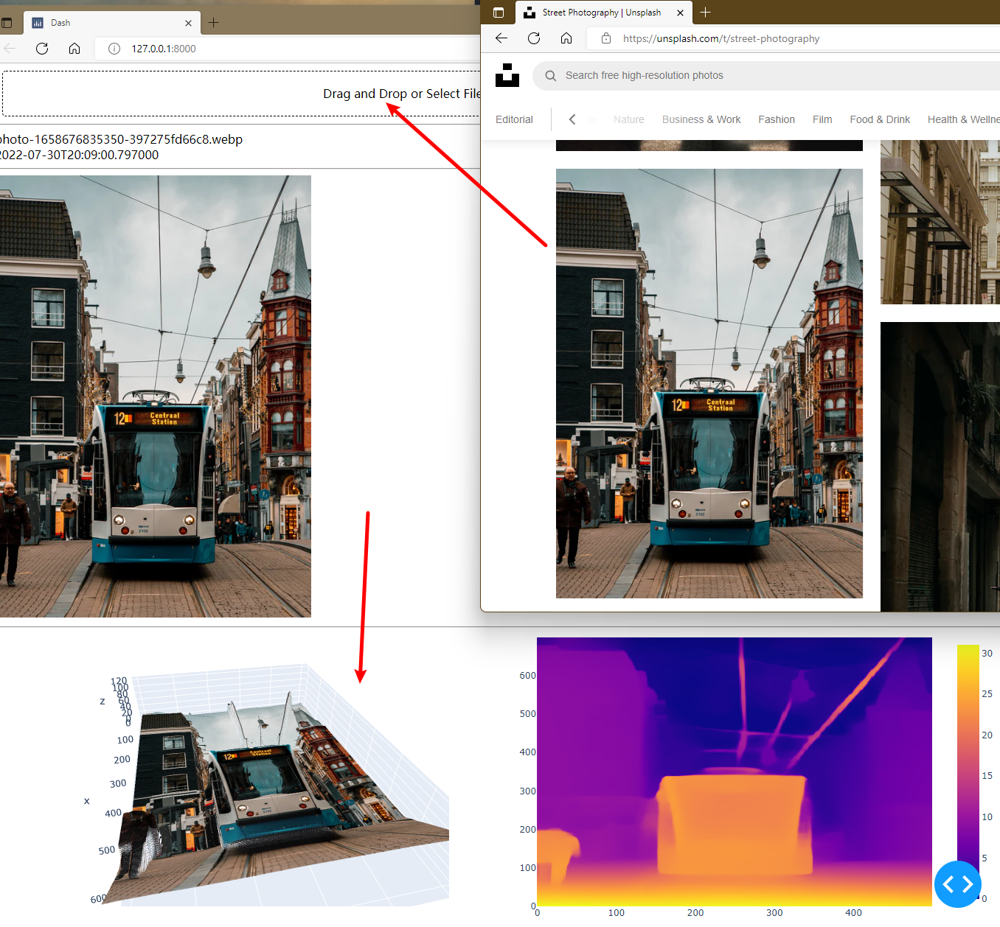

# 2D Pic to 3D Scene Transformer

I am a dash app to convert the 2D picture to its 3D scene.

---

The
[transformers](https://github.com/huggingface/transformers "transformers")
package is used to estimate the depth map,
and the depth map is used to generate the 3D cloud form the 3D picture.

All you need to do is startup the dash app.

```powershell
# Start up the dash to serve the request
$ python main.py
```

The dash app will automatically convert your picture to its 3D scene.

